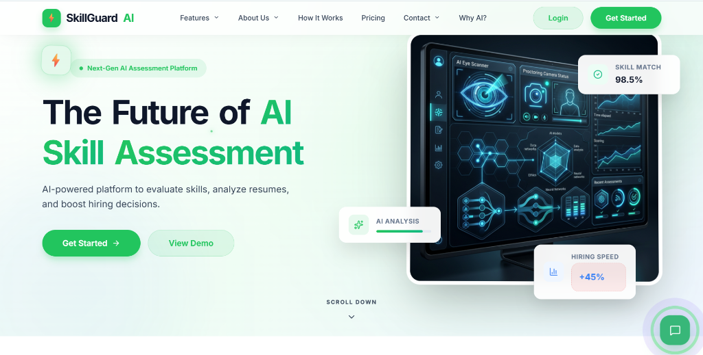
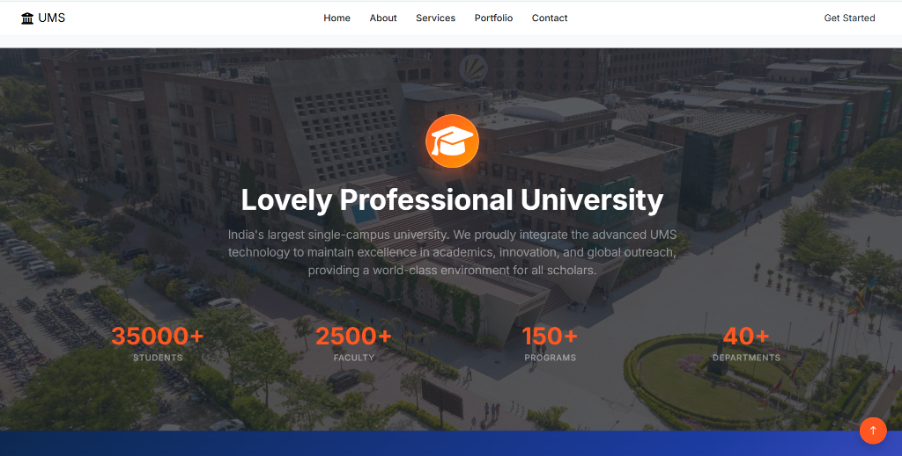
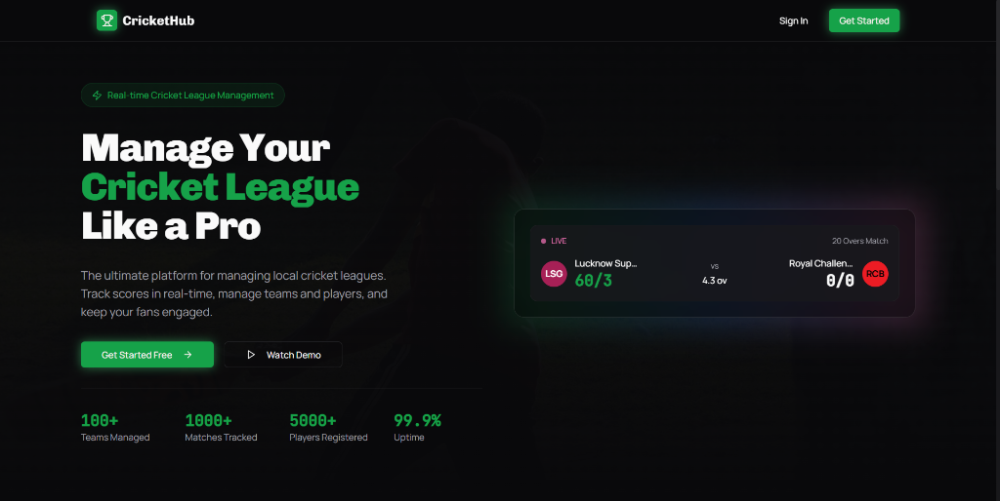
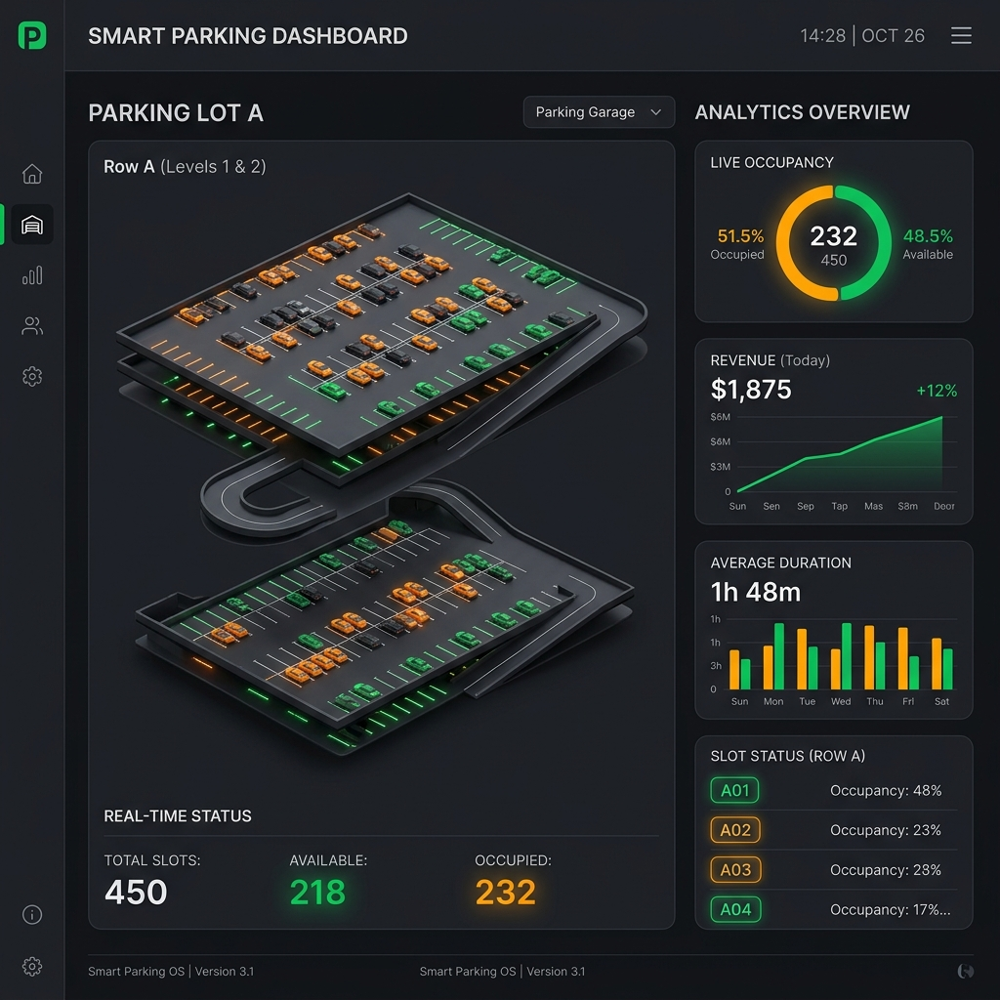

<div align="center">

  

  # ✦ Shahanwaj Khan — Personal Portfolio ✦
  
  **A Modern Editorial & Interactive Developer Showcase**

  [](https://developer.mozilla.org/en-US/docs/Web/HTML)
  [](https://developer.mozilla.org/en-US/docs/Web/CSS)
  [](https://developer.mozilla.org/en-US/docs/Web/JavaScript)
  [](https://vercel.com)
  [](LICENSE)

  [**🌐 View Live Portfolio**](https://shahanwajkhan.github.io/My-Portfolio/) &nbsp;•&nbsp; [**💬 Get in Touch**](mailto:shahanwajkhan@gmail.com)

</div>

---

## 📖 Overview

Welcome to my personal developer portfolio repo! This project features a high-end, editorial-style personal portfolio built from scratch with semantic HTML5, modern vanilla CSS3, and high-performance JavaScript. Inspired by Awwwards-winning developer websites, the aesthetic focuses on sleek serif typography (*Cormorant Garamond*), bold section titles (*Bebas Neue*), generous whitespace, dynamic cursor interactions, and responsive layouts.

---

## 🖼️ Portfolio Showcase & Featured Projects

Here is a visual glimpse of the core flagship projects highlighted in the portfolio:

| Project Mockup | Description & Links |
| :---: | :--- |
|  | ### 01. SkillGuard AI<br>An AI-powered career & skills evaluation engine with real-time resume analysis, automated skill gap assessments, and personalized learning pathways.<br><br>**Tech Stack:** `React.js` • `Tailwind CSS` • `Gemini API` • `Node.js`<br><br>🔗 [**Live Demo**](https://skill-guard-ai.vercel.app) &nbsp;\|&nbsp; 💻 [**GitHub Repository**](https://github.com/shahanwajkhan/SkillGuard-AI) |
|  | ### 02. University Management System<br>A comprehensive web portal for academic administration, automated course registrations, student grading, and faculty management.<br><br>**Tech Stack:** `PHP` • `MySQL` • `Bootstrap` • `JavaScript`<br><br>🔗 [**Live Demo**](https://ums-project.vercel.app/) &nbsp;\|&nbsp; 💻 [**GitHub Repository**](https://github.com/shahanwajkhan/University-Management-System) |
|  | ### 03. Cricket Management System<br>A real-time cricket match analytics platform tracking player performance metrics, tournament scoreboards, and team rosters.<br><br>**Tech Stack:** `JavaScript` • `Node.js` • `Express` • `Chart.js`<br><br>🔗 [**Live Demo**](https://cricket-hub-y63h.vercel.app/) &nbsp;\|&nbsp; 💻 [**GitHub Repository**](https://github.com/shahanwajkhan/Cricket-Management-System) |
|  | ### 04. FarmTech MIS<br>Smart agriculture management platform for Farmers, SHGs, & FPOs featuring crop advisory, AI scheme recommendations, GIS mapping, & yield prediction.<br><br>**Tech Stack:** `Laravel` • `PHP` • `MongoDB` • `Gemini API` • `Leaflet.js`<br><br>🔗 [**Live Demo**](https://farm-tech-mis.vercel.app/) &nbsp;\|&nbsp; 💻 [**GitHub Repository**](https://github.com/shahanwajkhan/FarmTech-MIS) |

---

## 🚀 More Notable Projects

<details open>
<summary><b>Click to expand full list of notable projects (05 - 12)</b></summary>
<br>

| # | Project Name | Description | Tech Stack | Quick Links |
| :-: | :--- | :--- | :--- | :--- |
| **05** | **FinSight Finance Dashboard** | Real-time financial monitoring dashboard tracking transactions, income streams, and expense charts. | `React` `Tailwind` `Chart.js` | 🔗 [Live Demo](https://fin-sight-orcin.vercel.app) \| 💻 [Code](https://github.com/shahanwajkhan/FinSight) |
| **06** | **Saree Palace Storefront** | Luxury e-commerce boutique storefront with sliding cart drawer and phone OTP customer loyalty portal. | `HTML5` `CSS3` `JavaScript` | 🔗 [Live Demo](https://saree-palace-eight.vercel.app) \| 💻 [Code](https://github.com/shahanwajkhan/Saree-Palace) |
| **07** | **Weather & Packing Planner** | Intelligent luggage packing assistant generating climate-tailored travel checklists based on forecast APIs. | `JavaScript` `Weather API` | 🔗 [Live Demo](https://weather-packing-planner-wine.vercel.app/) \| 💻 [Code](https://github.com/shahanwajkhan/Weather-Packing-Planner) |
| **08** | **AI Tutor Hub Chatbot** | Conversational AI study assistant enabling students to practice quizzes and clarify academic doubts. | `Python` `Flask` `JS` | 💻 [GitHub Repository](https://github.com/shahanwajkhan/AI-Tutor-Hub-Chatbot) |
| **09** | **Traffic Management System** | Real-time traffic flow control dashboard optimizing urban transit routes and monitoring congestion stats. | `PHP` `phpMyAdmin` `JS` | 🔗 [Live Demo](https://traffic-lime-rho.vercel.app) \| 💻 [Code](https://github.com/shahanwajkhan/Traffic-Management-System) |
| **10** | **AI Flashcard Generator** | Intelligent flashcard engine parsing study notes into dynamic review flashcard decks using Gemini API. | `JavaScript` `Gemini API` | 💻 [GitHub Repository](https://github.com/shahanwajkhan/AI-Flashcard-Generator) |
| **11** | **Dev Orbit Hub** | Developer productivity suite featuring online utility calculators, note-taking templates, and task trackers. | `Flask` `Gemini API` `JS` | 🔗 [Live Demo](https://dev-orbit-drab.vercel.app) \| 💻 [Code](https://github.com/shahanwajkhan/Dev_Orbit) |
| **12** | **Report Card Generator** | Academic report system with student performance average calculators and automated file generation. | `C++` `HTML` `CSS` `JS` | 🔗 [Live Demo](https://student-report-card-system.vercel.app) \| 💻 [Code](https://github.com/shahanwajkhan/Student-Report-Card-System) |

</details>

---

## ✨ Features & Micro-Interactions

- 🎯 **Dual-Ring Custom Interactive Cursor**: Custom cursor with magnetic pull dynamics and scaling hover targets over buttons & links.
- ⏳ **Timeline Preloader**: Smooth preloader sequence calculating asset loading percentage with a polished slide-out transition.
- 📈 **Intersection-Observer Counter Animations**: Automated counting animations for project statistics, skills, and certifications when scrolled into view.
- 🎨 **Editorial Layout Aesthetics**: Pairing high-elegance serif typography (*Cormorant Garamond*) with striking display headlines (*Bebas Neue*) and clean body copy (*Inter*).
- ✉️ **Interactive Contact Form Validation**: Real-time form checks, paper airplane launch animation, and feedback alerts upon message submission.
- ♿ **Accessibility & Reduced Motion**: Optimized keyboard navigation focus rings and support for OS `prefers-reduced-motion`.

---

## 🛠️ Local Development & Quick Start

To run and preview the portfolio website on your local machine:

### Option 1: Using Node.js (`serve`)
```bash
npx serve .
```
Then navigate to `http://localhost:3000` in your web browser.

### Option 2: Using Python HTTP Server
```bash
python -m http.server 8000
```
Then navigate to `http://localhost:8000` in your web browser.

### Option 3: VS Code Live Server Extension
Right-click `index.html` inside VS Code and choose **"Open with Live Server"**.

---

## 📂 Repository File Structure

```
MyPortfolio/
├── index.html            # Main markup page containing all portfolio sections
├── css/
│   └── style.css         # Typography tokens, responsive grid system, micro-animations
├── js/
│   └── script.js         # Interactive scroll events, preloader, counters, form validation
├── assets/
│   ├── profile.jpg       # Main profile picture
│   ├── profile.png       # Transparent profile variant
│   ├── project-1.jpg     # Visual preview for SkillGuard AI
│   ├── project-2.jpg     # Visual preview for University Management System
│   ├── project-3.jpg     # Visual preview for Cricket Management System
│   ├── project-4.jpg     # Visual preview for FarmTech MIS
│   └── resume.pdf        # Downloadable developer resume
└── README.md             # Visual documentation (this file)
```

---

<div align="center">

  **Designed & Developed by Shahanwaj Khan**
  
  [Website](https://shahanwajkhan.github.io/My-Portfolio/) • [GitHub](https://github.com/shahanwajkhan) • [LinkedIn](https://linkedin.com/in/shahanwaj-khan)

</div>
